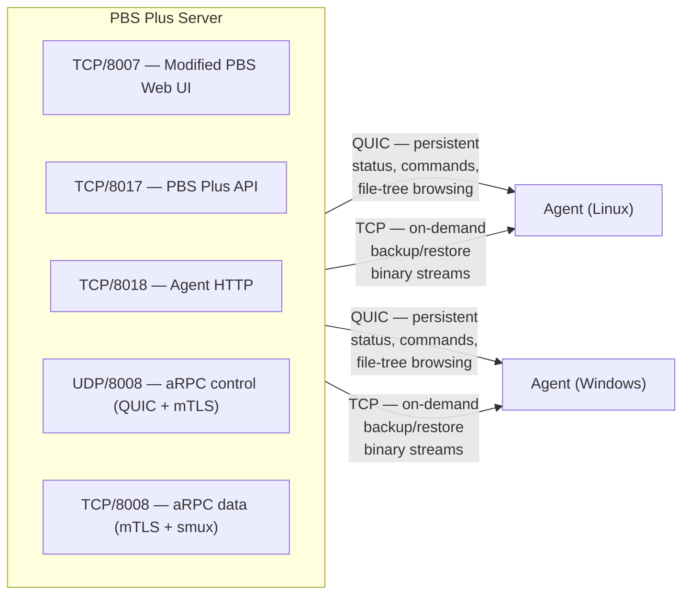

# Architecture

PBS Plus extends a stock Proxmox Backup Server with file-level backup/restore capabilities and a read/write FUSE mount for pxar archives. It runs as a sidecar service on the PBS host and communicates with agents on target machines.

## Components

| Component | Binary | Runs on |
|---|---|---|
| PBS Plus server | `pbs-plus` | PBS host (Linux) |
| Agent (Windows) | `pbs-plus-agent.exe` | Target workstations |
| Agent (Linux) | `pbs-plus-agent` | Target workstations / containers |
| Kubernetes operator | `pbs-plus-operator` | Kubernetes cluster |
| pxar-mount | `pxar-mount` | PBS host (bundled with server) |

## Network Topology

### Ports

| Port | Protocol | Purpose |
|---|---|---|
| 8007 | HTTPS | Proxied PBS Web UI with Disk Backup UI injected |
| 8017 | HTTPS | PBS Plus REST API — job CRUD, token management, metrics |
| 8018 | HTTPS | Agent HTTP endpoint — bootstrap, certificate renewal, drive status |
| 8008 | QUIC (UDP) | aRPC control plane — persistent mTLS connection for status, commands, file-tree browsing |
| 8008 | TCP+mTLS | aRPC data plane — temporary smux streams for backup/restore data |

## How Backup Works

1. User creates a **backup job** via the Disk Backup UI (or API) specifying a target, datastore, schedule, and optional exclusion rules.
2. The **scheduler** fires the job. The server sends a backup command to the agent over the QUIC control plane.
3. The agent **forks a subprocess** that establishes a TCP+mTLS+smux data connection to the server.
4. The server mounts the agent's filesystem via **FUSE over aRPC** (`arpcfs`), making the remote files appear as a local directory.
5. The server runs `proxmox-backup-client` against the FUSE mount to create a standard PBS snapshot in the datastore.
6. On completion, the FUSE mount is torn down and the agent subprocess exits.

## How Restore Works

1. User creates a **restore job** specifying snapshot, source path, and destination target.
2. The server sends a restore command over QUIC. The agent forks a subprocess.
3. A TCP+mTLS+smux data connection is established.
4. The agent's restore subprocess pulls file data from the server and writes it to the destination path on the agent host.
5. Integrity is verified via sha256 checksums.

## Internal Packages

```mermaid
graph TD
    internal["internal/"]
    internal --> agent["agent/"]
    agent --> agentfs["agentfs/ — Filesystem enumeration"]
    agent --> cli["cli/ — Command-line modes"]
    agent --> lifecycle["lifecycle/ — Service lifecycle"]
    agent --> migration["migration/ — Registry migrations"]
    agent --> registry["registry/ — Config storage"]
    agent --> snapshots["snapshots/ — Block-level snapshots (VSS)"]
    agent --> sync["sync/ — Volume status sync"]
    internal --> arpc["arpc/ — Agent RPC (QUIC + TCP)"]
    internal --> calendar["calendar/ — Schedule parser"]
    internal --> conf["conf/ — Env config singleton"]
    internal --> mtls["mtls/ — mTLS certificate mgmt"]
    internal --> operator["operator/ — K8s controller"]
    internal --> pxar["pxar/ — Pxar format reader/client"]
    internal --> pxarmount["pxarmount/ — FUSE + journal + commit"]
    internal --> safemap["safemap/ — Thread-safe map"]
    internal --> server["server/"]
    server --> application["application/ — Business logic services"]
    server --> backup["backup/ — Backup orchestration, FUSE mounts"]
    server --> database["database/ — SQLite + migrations + sqlc"]
    server --> jobs["jobs/ — Job scheduling & execution"]
    server --> mount["mount/ — pxar-mount management"]
    server --> proxmox["proxmox/ — PBS integration"]
    server --> restore["restore/ — Restore orchestration"]
    server --> rpc["rpc/ — Server-side aRPC handlers"]
    server --> scheduler["scheduler/ — Cron-like scheduler"]
    server --> store["store/ — Central store"]
    server --> vfs["vfs/"]
    vfs --> arpcfs["arpcfs/ — FUSE over aRPC"]
    vfs --> s3fs["s3fs/ — S3 target filesystem"]
    vfs --> sessions["sessions/ — smux session mgmt"]
    internal --> syslog["syslog/ — Structured logging"]
    internal --> validate["validate/ — Input validation"]
```

## Database

The server uses SQLite (via `modernc.org/sqlite` — no CGo) for job, target, token, exclusion, and script storage. Migrations live in `internal/server/database/migrations/`. Query code is generated by sqlc (`sqlc.yaml`).

## Web UI

PBS Plus injects custom JavaScript into the stock PBS web interface:

- **Pre-load scripts** (`views/pre/`): initialization, utilities, log viewer, task viewer
- **Custom scripts** (`views/custom/`): navigation, Disk Backup UI, snapshot mount UI, data models
- **Panels/Windows**: job editors, target selectors, backup/restore dialogs

The injection works by proxying port 8007 and prepending the custom JS to PBS responses. The proxy is torn down when `pbs-plus` is stopped.
