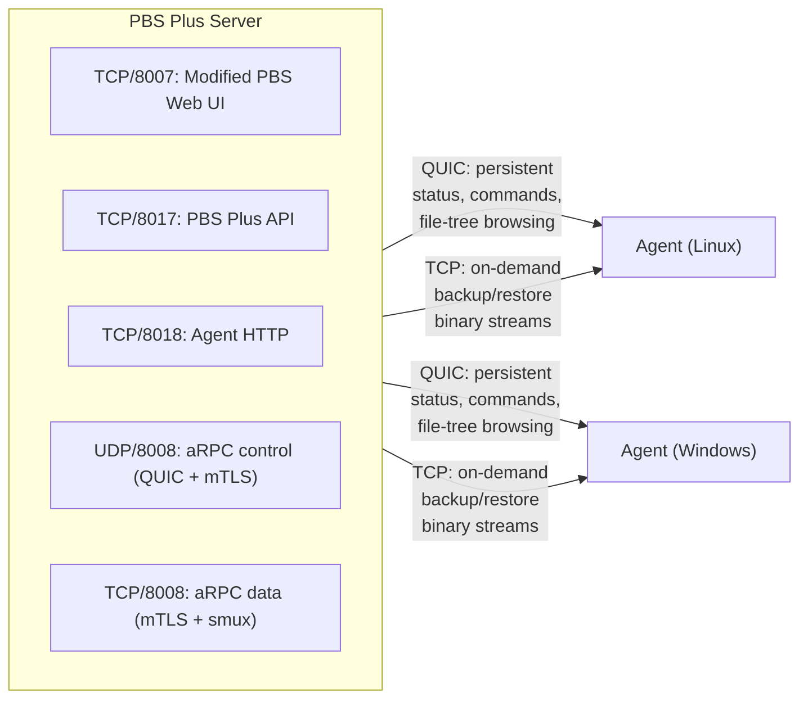

# Architecture

PBS Plus extends a stock Proxmox Backup Server with file-level backup/restore, native database backups, a read/write FUSE mount for pxar archives, MTF tape migration, and a Kubernetes operator. It runs as a sidecar service on the PBS host and communicates with agents on target machines.

## Components

| Component           | Binary               | Runs on                          |
| ------------------- | -------------------- | -------------------------------- |
| PBS Plus server     | `pbs-plus`           | PBS host (Linux)                 |
| Agent (Windows)     | `pbs-plus-agent.exe` | Target workstations              |
| Agent (Linux)       | `pbs-plus-agent`     | Target workstations / containers |
| Kubernetes operator | `pbs-plus-operator`  | Kubernetes cluster               |
| pxar-mount          | `pxar-mount`         | PBS host (separate package)      |
| bkf2pxar            | `bkf2pxar`           | PBS host (bundled with server)   |
| mtfprobe            | `mtfprobe`           | PBS host (built from source)     |

`bkf2pxar` converts Windows Backup (BKF) / MTF tape images to pxar archives. `mtfprobe` inspects MTF tape contents without running a migration; it is built from source (`go build ./cmd/mtfprobe`) and not part of the release packages.

## Network Topology

```mermaid
graph LR
    subgraph Server["PBS Plus Server"]
        direction LR
        WUI["TCP/8007: Modified PBS Web UI"]
        API["TCP/8017: PBS Plus API"]
        HTTP["TCP/8018: Agent HTTP"]
        QUIC["UDP/8008: aRPC control (QUIC + mTLS)"]
        TCP["TCP/8008: aRPC data (mTLS + smux)"]
    end

    AgentL["Agent (Linux)"]
    AgentW["Agent (Windows)"]

    Server -- "QUIC: persistent\nstatus, commands,\nfile-tree browsing" --> AgentL
    Server -- "QUIC: persistent\nstatus, commands,\nfile-tree browsing" --> AgentW
    Server -- "TCP: on-demand\nbackup/restore\nbinary streams" --> AgentL
    Server -- "TCP: on-demand\nbackup/restore\nbinary streams" --> AgentW
```

### Ports

| Port | Protocol   | Purpose                                                                                 |
| ---- | ---------- | --------------------------------------------------------------------------------------- |
| 8007 | HTTPS      | Proxied PBS Web UI with the PBS Plus views injected                                     |
| 8017 | HTTPS      | PBS Plus REST API: job CRUD, token management, metrics                                  |
| 8018 | HTTPS      | Agent HTTP endpoint: bootstrap, certificate renewal, drive status                       |
| 8008 | QUIC (UDP) | aRPC control plane: persistent mTLS connection for status, commands, file-tree browsing |
| 8008 | TCP+mTLS   | aRPC data plane: temporary smux streams for backup/restore data                         |

## How Backup Works

Filesystem targets:

1. User creates a **backup job** via the Backup / Restore page (or API) specifying a target, datastore, schedule, and optional exclusion rules.
2. The **scheduler** fires the job. The server sends a backup command to the agent over the QUIC control plane.
3. The agent **forks a subprocess** that establishes a TCP+mTLS+smux data connection to the server.
4. The server mounts the agent's filesystem via **FUSE over aRPC** (`arpcfs`), making the remote files appear as a local directory.
5. The server runs `proxmox-backup-client` against the FUSE mount to create a standard PBS snapshot in the datastore.
6. On completion, the FUSE mount is torn down and the agent subprocess exits.

Database targets (PostgreSQL, MySQL/MariaDB):

1. The server picks the installed dump client (`pg_dump`, `mysqldump`, or `mariadb-dump`) whose version matches the live database server, unless the target pins a specific client directory.
2. The dump runs on the PBS host against the database server. Server-wide scope dumps every database to its own file plus PostgreSQL globals; database scope dumps a single named database.
3. Dump files, a checksum manifest, and the connection secrets are staged as split pxar archives (`.mpxar.didx` / `.ppxar.didx`) and written to the datastore as a normal PBS snapshot. No agent is involved.

LDAP targets (including logical Active Directory exports):

1. The server runs `ldapsearch` with paged results and fail-closed StartTLS/LDAPS verification, then stages replayable LDIF with server-maintained attributes stripped.
2. Server scope dumps the target's base DN; database scope dumps a single subtree DN. The manifest records the source base DN and SHA-256 checksum.
3. Restore validates the snapshot and selected subtree before any deletion, orders entries parent-first, and runs `ldapmodify` in add mode. Replace-existing restores use `ldapdelete` only after that preflight.
4. LDAP snapshots contain readable directory data, not server state. Active Directory System State, NTDS.dit, SYSVOL, password secrets, tombstones, and replication state are outside this target's scope.

Dovecot targets:

1. The server selects Dovecot 2.4 or newer `doveadm` client tools and creates an ephemeral client configuration containing the shared doveadm password, local staging storage, and a private copy of the target CA certificate.
2. `doveadm backup --no-userdb-lookup -R` pulls one remote user's mailbox data over `tcps:` into a mode-0700 staging directory. An optional mailbox filter narrows the transfer.
3. The password and CA copy are removed before the staged mail data and manifest enter the normal PBS snapshot pipeline. The original CA file remains on the server.
4. Restore validates the manifest and staged mail directory, then uses one-way `doveadm sync` (run twice so the first pass can reconcile mailbox GUID state) for additive recovery or `doveadm backup` for replace-existing mirror semantics. The destination user may differ from the source user. Replace requires fresh or empty destination mail storage because Dovecot never allows deleting an existing INBOX; restoring into divergent state fails the task instead of partially applying.
5. This path preserves mailbox data and metadata only. Dovecot configuration, user databases, TLS keys, Sieve, and host state are outside its scope.

S3 targets are backed up by reading the bucket through the `s3fs` virtual filesystem instead of an agent mount.

## How Restore Works

Filesystem targets:

1. User creates a **restore job** specifying snapshot, source path, and destination target.
2. The server sends a restore command over QUIC. The agent forks a subprocess.
3. A TCP+mTLS+smux data connection is established.
4. The agent's restore subprocess pulls file data from the server and writes it to the destination path on the agent host.
5. Integrity is verified via sha256 checksums.

Database targets restore a dump archive back into a running database server using the matching restore client (`pg_restore`, `mysql`, or `mariadb`). A server-wide dump can restore a single source database, optionally renamed via a destination database name, with optional replace-existing semantics. LDAP targets validate and order selected LDIF entries before replaying them under their original DNs; replace-existing deletes the subtree only after preflight succeeds. Dovecot targets restore staged mailbox data over verified `tcps:` transport, using additive sync or replace-existing mirror semantics; replace targets fresh or empty destination mail storage and fails loudly otherwise.

## Internal Packages

```mermaid
graph TD
    internal["internal/"]
    internal --> agent["agent/"]
    agent --> agentfs["agentfs/ - Filesystem enumeration"]
    agent --> binswap["binswap/ - Atomic binary swaps for self-update"]
    agent --> cli["cli/ - Command-line modes"]
    agent --> lifecycle["lifecycle/ - Service lifecycle"]
    agent --> migration["migration/ - Registry migrations"]
    agent --> registry["registry/ - Config storage"]
    agent --> snapshots["snapshots/ - Block-level snapshots (VSS)"]
    agent --> sync["sync/ - Volume status sync"]
    agent --> updater["updater/ - Self-update"]
    agent --> agentverif["verification/ - Agent-side file verification"]
    internal --> arpc["arpc/ - Agent RPC (QUIC + TCP)"]
    internal --> calendar["calendar/ - Schedule parser"]
    internal --> changer["changer/ - SCSI media changer (SMC)"]
    internal --> conf["conf/ - Env config singleton"]
    internal --> crypto["crypto/ - Token manager, encryption helpers"]
    internal --> filetree["filetree/ - Shared file-tree types"]
    internal --> host["host/ - Host info helpers"]
    internal --> log["log/ - Structured logging"]
    internal --> mtls["mtls/ - mTLS certificate mgmt"]
    internal --> operator["operator/ - K8s controller"]
    internal --> proxmox["proxmox/ - PBS client (cli, tape, tasklog, token)"]
    internal --> pxar["pxar/ - Pxar format reader/client"]
    internal --> pxarmount["pxarmount/ - FUSE + journal + commit"]
    internal --> safemap["safemap/ - Thread-safe map"]
    internal --> sqldb["sqldb/ - SQLite driver bootstrap"]
    internal --> tapeio["tapeio/ - LTO tape reads, BKF/MTF to pxar"]
    internal --> validate["validate/ - Input validation"]
    internal --> server["server/"]
    server --> application["application/ - Business logic services"]
    server --> backup["backup/ - Backup orchestration, FUSE mounts"]
    server --> bootstrap["bootstrap/ - Server startup wiring"]
    server --> coredb["coredb/ - SQLite store, migrations, sqlc queries"]
    server --> database["database/ - Dump/restore client bundles"]
    server --> dovecot["dovecot/ - Mailbox backup/restore over doveadm"]
    server --> jobs["jobs/ - Job engine and workflows (jobrpc, mountrpc)"]
    server --> mtf["mtf/ - MTF tape migration jobs (+ mtfdb)"]
    server --> notification["notification/ - Alerts, batched notifications"]
    server --> restore["restore/ - Restore orchestration"]
    server --> rpc["rpc/ - Server-side aRPC handlers"]
    server --> rpcserver["rpcserver/ - aRPC listener setup"]
    server --> scheduler["scheduler/ - Cron-like scheduler"]
    server --> snapshotmount["snapshotmount/ - Server-managed mounts, profiles, auto-mount"]
    server --> systemd["systemd/ - Mount units, process runner fallback"]
    server --> verification["verification/ - Verification jobs"]
    server --> vfs["vfs/"]
    vfs --> arpcfs["arpcfs/ - FUSE over aRPC"]
    vfs --> s3fs["s3fs/ - S3 target filesystem"]
    vfs --> sessions["sessions/ - smux session mgmt"]
    server --> web["web/"]
    web --> webapi["api/ - Per-domain HTTP handlers (targetapi, backupapi, mountapi, mtfapi, restoreapi, and more)"]
    web --> webui["ui/ - Panels and windows (management, mount, mtf, tape, verification)"]
```

## Database

The server uses SQLite (via `modernc.org/sqlite`, no CGo) for job, target, token, exclusion, script, notification batch, verification job, and MTF migration storage. Migrations live in `internal/server/coredb/migrations/`. Query code is generated by sqlc (`sqlc.yaml`) into `internal/server/coredb/corequery/`.

### Target Model

Targets use a common record plus one detail record for their kind:

- `targets` stores the stable name, kind, and mount script.
- `target_filesystems` stores filesystem access (`local` or `agent`), path, host, and volume metadata.
- `target_s3` stores the S3 URL and encrypted secret.
- `target_postgresql` stores connection details: host, port, username, TLS mode, CA certificate, and an optional pinned client directory.
- `target_mysql` stores the same plus the server variant (`mysql` or `mariadb`).
- `target_ldap` stores connection details plus the base DN.
- `target_dovecot` stores the doveadm listener, encrypted shared password, CA certificate path, and optional pinned client directory.

The internal contract is `kind: filesystem|s3|postgresql|mysql|ldap|dovecot` plus a kind-specific detail row. The target API also returns `kind` and `access`, while keeping the legacy `target_type: local|agent|s3` value for existing clients.

A new target kind adds one detail table, its sqlc persistence queries, validation in `normalizeTarget`, and its backup or restore execution path. Common target columns and existing detail tables stay unchanged.

### Size Metadata

`ResolveTargetSize` (in `internal/server/application/services.go`) reports total, used, and free bytes per target. Local filesystem targets get the numbers from `statfs` on the target path; agent and database targets use volume metadata already reported by the agent or stored on the target record. No target contents are scanned.

## Web UI

PBS Plus injects custom JavaScript into the stock PBS web interface:

- **Pre-load scripts** (`web/views/pre/`): initialization, utilities, log viewer, task viewer
- **View registry** (`web/ui/views.go`): declares every custom panel and the navigation tree
- **Panels/Windows** (`web/ui/`): management, mount, MTF, tape, and verification panels

All custom pages are nested under a **PBS Plus** navigation node:

- **PBS Plus Configuration**: Global Exclusions, Scripts, Notification Batches, Alert Settings
- **Backup / Restore**: Backup Jobs, Restore Jobs
- **Targets**: Filesystem, S3, PostgreSQL, MySQL/MariaDB, Agent Bootstrap
- **Snapshots**: Active Mounts, Mount Profiles, one tab per datastore
- **Data Verification**: Verification Jobs
- **MTF Migration**: Inventory, Changers, Drives, Namespace Mappings, Migration Jobs

The injection works by proxying port 8007 and prepending the custom JS to PBS responses. The proxy is torn down when `pbs-plus` is stopped.
