# Development

## Repository Structure

```mermaid
graph TD
    root["."] --> cmd
    root --> internal["internal/ — library code"]
    root --> build
    root --> deploy
    root --> github["github/"]
    root --> Dockerfile
    root --> DockerfileOp["Dockerfile.operator"]
    root --> sqlc["sqlc.yaml"]
    root --> goreleaser["goreleaser.yaml"]

    cmd --> pbs_plus["pbs_plus/ — Server binary"]
    cmd --> agent["agent/ — Agent binary (Linux/Windows)"]
    cmd --> pxarmount["pxar-mount/ — FUSE mount binary"]
    cmd --> operator["operator/ — K8s operator"]
    cmd --> signer["signer/ — Ed25519 update signer"]

    build --> container["container/ — Agent Docker image files"]
    build --> pkg["package/ — MSI/DEB packaging"]
    build --> tests["tests/ — CI test Dockerfile"]

    deploy --> k8s["kubernetes/ — Operator manifests"]

    github --> workflows["workflows/ — CI/CD"]
    github --> actions["actions/ — Reusable composite actions"]
```



## Building

### Prerequisites

- Go 1.26+
- For server: Linux (Debian/Proxmox)
- For Windows agent: cross-compilation from any OS

### Build commands

```bash
# Server
go build -o pbs-plus ./cmd/pbs_plus

# Linux agent
CGO_ENABLED=0 go build -tags=agent -o pbs-plus-agent ./cmd/agent

# pxar-mount
CGO_ENABLED=0 go build -o pxar-mount ./cmd/pxar-mount

# All (via goreleaser)
goreleaser release --clean
```

## CI Workflows

### `tests.yml` — PR gate (triggered on pull requests to `main`)

Reuses two workflows:

| Workflow | Jobs | What it does |
|---|---|---|
| `go-tests.yml` | `ubuntu-24.04`, `windows-2025` | `go test -race ./...` on both platforms |
| `e2e-tests.yml` | `ubuntu-24.04` | Full Docker-based integration test |

### E2E test flow

The E2E test builds Docker images, deploys a PBS+ server container, runs an agent, and validates backup + restore + pxar-mount operations:

1. **Setup environment** — Go, Rust, system deps (FUSE, etc.)
2. **Build images** — server test image (`build/tests/Dockerfile`) + agent image (`Dockerfile`)
3. **Start PBS+ server** — Docker container with FUSE/`/dev/fuse` access
4. **Test HTTPS endpoints** — verify ports 8007/8017 respond
5. **Initialize PBS+** — create datastore, backup job, generate agent token
6. **Start agent** — Docker container, bootstraps via token
7. **Run backup** — triggers backup, waits for completion, verifies
8. **Run restore** — restores from snapshot, verifies sha256 checksums
9. **Run pxar-mount e2e** — FUSE mount tests (init mode, mount mode, commits, ACLs, edge cases)
10. **Cleanup** — remove containers and network

### Composite actions

All E2E steps are in `.github/actions/` as reusable composite actions:

| Action | Description |
|---|---|
| `setup-test-env` | Install Go, Rust, FUSE deps |
| `build-images` | Build server and agent Docker images |
| `setup-pbs-server` | Start PBS+ container, wait for readiness |
| `test-endpoints` | Verify HTTPS endpoints |
| `init-pbs` | Create datastore, job, generate token |
| `setup-agent` | Create test data, start agent container |
| `run-backup` | Trigger and verify backup |
| `run-restore` | Trigger and verify restore with integrity check |
| `run-pxar-e2e` | Run pxar-mount FUSE e2e test inside PBS container |
| `show-logs` | Dump container logs on failure |
| `cleanup` | Remove containers and network |

### pxar-mount E2E script

Located at `.github/actions/run-pxar-e2e/run.sh`. Configurable via environment variables:

| Variable | Default | Description |
|---|---|---|
| `PBS_STORE` | `/mnt/test` | PBS datastore path inside container |
| `NAMESPACE` | `test` | PBS namespace |
| `BACKUP_ID` | `test-host` | Backup host ID |
| `BACKUP_DISK` | `Root` | Disk ID (matches agent drive letter) |
| `PXAR_MOUNT_BIN` | `/usr/bin/pxar-mount` | Path to pxar-mount binary |

Test phases:
1. Init mode — fresh archive, create files, commit, re-commit
2. Mount mode — mount existing archive, mutations, commit
3. Fresh mount — verify committed data persists in new snapshot
4. Edge cases — rename chains, replace, directory rename, empty/non-empty rmdir
5. Rapid fire — 5 sequential commits with verification
6. ACL tests — `setfacl`/`getfacl` preservation through commits
7. Large file — 1MB binary, sha256 integrity through commit

## Release

Triggered by pushing a tag. The `release.yml` workflow:

1. **GoReleaser** — builds server, agent (Linux amd64/arm64), pxar-mount
2. **MSI** — builds Windows installer via WiX on `windows-2025`
3. **Docker** — builds and pushes agent image to GHCR (multi-arch)
4. **Docker operator** — builds and pushes operator image to GHCR
