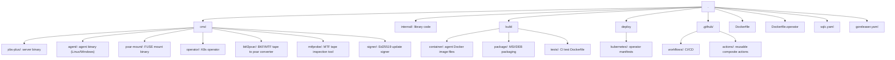

# Development

## Repository Structure


```mermaid
graph TD
    root["."] --> cmd
    root --> internal["internal/: library code"]
    root --> build
    root --> deploy
    root --> github[".github/"]
    root --> Dockerfile
    root --> DockerfileOp["Dockerfile.operator"]
    root --> sqlc["sqlc.yaml"]
    root --> goreleaser["goreleaser.yaml"]

    cmd --> pbsplus["pbs-plus/: server binary"]
    cmd --> agent["agent/: agent binary (Linux/Windows)"]
    cmd --> pxarmount["pxar-mount/: FUSE mount binary"]
    cmd --> operator["operator/: K8s operator"]
    cmd --> bkf2pxar["bkf2pxar/: BKF/MTF tape to pxar converter"]
    cmd --> mtfprobe["mtfprobe/: MTF tape inspection tool"]
    cmd --> signer["signer/: Ed25519 update signer"]

    build --> container["container/: agent Docker image files"]
    build --> pkg["package/: MSI/DEB packaging"]
    build --> tests["tests/: CI test Dockerfile"]

    deploy --> k8s["kubernetes/: operator manifests"]

    github --> workflows["workflows/: CI/CD"]
    github --> actions["actions/: reusable composite actions"]
```

Library code layout is documented in [Architecture](architecture.md#internal-packages) and naming rules in [CONVENTIONS](CONVENTIONS.md).

## Building

### Prerequisites

- Go 1.27+
- For server: Linux (Debian/Proxmox)
- For Windows agent: cross-compilation from any OS

### Build commands

```bash
# Server
go build -o pbs-plus ./cmd/pbs-plus

# Linux agent
CGO_ENABLED=0 go build -tags=agent -o pbs-plus-agent ./cmd/agent

# pxar-mount
CGO_ENABLED=0 go build -o pxar-mount ./cmd/pxar-mount

# All (via goreleaser)
goreleaser release --clean
```

Database backups rely on dump clients (`pg_dump`, `pg_restore`, `mysqldump`/`mariadb-dump`, `mysql`/`mariadb`) being installed on the PBS host. The server discovers them at runtime and picks the one matching the live database server version.

## CI Workflows

| Workflow             | Trigger                 | What it does                                               |
| -------------------- | ----------------------- | ---------------------------------------------------------- |
| `tests.yml`          | pull requests to `main` | Reuses `go-tests.yml` and `e2e-tests.yml`                  |
| `go-tests.yml`       | via `tests.yml`         | `go test -race ./...` on `ubuntu-24.04` and `windows-2025` |
| `e2e-tests.yml`      | via `tests.yml`         | Full Docker-based integration test                         |
| `release.yml`        | tag push                | GoReleaser, MSI, Docker images (see Release)               |
| `cleanup-drafts.yml` | scheduled               | Deletes stale draft releases                               |
| `cleanup-rcs.yml`    | scheduled               | Deletes stale release candidates                           |

### E2E test flow

The E2E test builds Docker images, deploys a PBS+ server container, and validates the full feature set:

1. **Setup environment**: Go, Rust, system deps (FUSE, etc.)
2. **Build images**: server test image (`build/tests/Dockerfile`) + agent image (`Dockerfile`)
3. **Start PBS+ server**: Docker container with FUSE/`/dev/fuse` access
4. **Test HTTPS endpoints**: verify ports 8007/8017 respond
5. **Initialize PBS+**: create datastore, backup job, generate agent token
6. **Run database backups**: database backup jobs against containerized database servers, verifying logs and restores
7. **Start agent**: Docker container, bootstraps via token
8. **Run backup**: trigger backup, wait for completion, verify task log
9. **Run concurrent backups**: queue four jobs and validate each PBS UPID
10. **Run notification batch**: restart mid-batch, verify the flush and spool drain
11. **Run restore**: restore from snapshot, verify sha256 checksums
12. **Run verification**: verification job against the backed-up target
13. **Run pxar-mount e2e**: FUSE mount tests (init mode, mount mode, commits, ACLs, edge cases)
14. **Run mount e2e**: server-managed snapshot mounts (sessions, profiles, compose) through the API
15. **Cleanup**: remove containers and network

### Composite actions

All E2E steps are in `.github/actions/` as reusable composite actions:

| Action                   | Description                                                 |
| ------------------------ | ----------------------------------------------------------- |
| `setup-test-env`         | Install Go, Rust, FUSE deps                                 |
| `build-images`           | Build server and agent Docker images                        |
| `setup-pbs-server`       | Start PBS+ container, wait for readiness                    |
| `test-endpoints`         | Verify HTTPS endpoints                                      |
| `init-pbs`               | Create datastore, job, generate token                       |
| `run-database-backups`   | Database backup jobs against containerized database servers |
| `setup-agent`            | Create test data, start agent container                     |
| `run-backup`             | Trigger and verify backup                                   |
| `verify-task-log`        | Assert expected entries in the PBS task log                 |
| `run-concurrent-backups` | Queue four backups and validate distinct PBS UPIDs          |
| `run-notification-batch` | Verify batched notifications survive a restart              |
| `run-restore`            | Trigger and verify restore with integrity check             |
| `run-verification`       | Trigger and verify a verification job                       |
| `run-pxar-e2e`           | Run pxar-mount FUSE e2e test inside PBS container           |
| `run-mount-e2e`          | Run server-managed mount e2e test                           |
| `show-logs`              | Dump container logs on failure                              |
| `cleanup`                | Remove containers and network                               |

### pxar-mount E2E script

Located at `.github/actions/run-pxar-e2e/run.sh`. Configurable via environment variables:

| Variable         | Default               | Description                          |
| ---------------- | --------------------- | ------------------------------------ |
| `PBS_STORE`      | `/mnt/test`           | PBS datastore path inside container  |
| `NAMESPACE`      | `test`                | PBS namespace                        |
| `BACKUP_ID`      | `test-host`           | Backup host ID                       |
| `BACKUP_DISK`    | `Root`                | Disk ID (matches agent drive letter) |
| `PXAR_MOUNT_BIN` | `/usr/bin/pxar-mount` | Path to pxar-mount binary            |

Test phases:

1. Init mode: fresh archive, create files, commit, re-commit
2. Mount mode: mount existing archive, mutations, commit
3. Fresh mount: verify committed data persists in new snapshot
4. Edge cases: rename chains, replace, directory rename, empty/non-empty rmdir
5. Rapid fire: 5 sequential commits with verification
6. ACL tests: `setfacl`/`getfacl` preservation through commits
7. Large file: 1MB binary, sha256 integrity through commit

## Release

Triggered by pushing a tag. The `release.yml` workflow:

1. **GoReleaser**: builds server, agent (Linux/FreeBSD amd64/arm64), pxar-mount, bkf2pxar
2. **MSI**: builds Windows installer via WiX on `windows-2025`
3. **Docker**: builds and pushes agent image to GHCR (multi-arch)
4. **Docker operator**: builds and pushes operator image to GHCR
