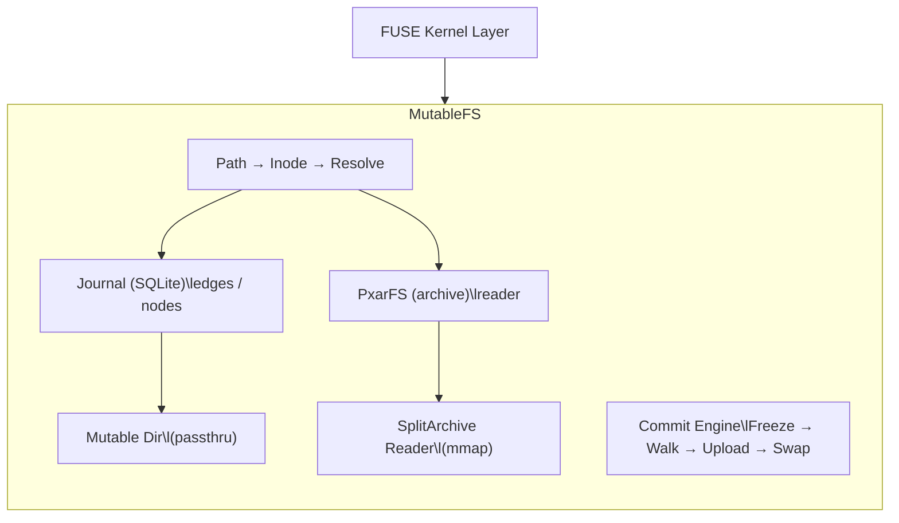

# pxar-mount

`pxar-mount` is the user-space FUSE filesystem that powers PBS Plus file operations. It presents PBS pxar archives as a standard read/write mount, with changes tracked in an SQLite journal overlay.

## Key Features

- **Read/write FUSE mount** of any PBS pxar archive snapshot
- **Journal overlay** — all mutations (create, delete, rename, chmod, xattr, ACL) tracked in SQLite without modifying the original archive
- **Commit (re-snapshot)** — efficiently produces a new PBS snapshot using payload deduplication; only new/modified content is uploaded
- **Init mode** — start with an empty filesystem and build archives from scratch
- **Passthrough mode** — mutable file data lives in a local backing directory for zero-copy writes
- **Whiteout support** — deleted pxar entries become invisible whiteout markers
- **ACL / symlink / xattr support**
- **Rapid-fire commits** — re-commit within the same second via monotonically increasing timestamps
- **Crash safety** — mount continues serving the previous archive if commit upload fails

## Quick Start

```bash
# Mount an existing archive read/write
pxar-mount \
  --passthrough /tmp/overlay \
  --mpxar-didx /path/to/snapshot/archive.mpxar.didx \
  --ppxar-didx /path/to/snapshot/archive.ppxar.didx \
  --pbs-store /path/to/pbs-datastore \
  --options rw,allow_other \
  --socket /var/run/pxar-mount.sock \
  /mnt/archive

# Create a new archive from scratch (init mode)
pxar-mount init \
  --passthrough /tmp/overlay \
  --pbs-store /path/to/pbs-datastore \
  --socket /var/run/pxar-mount.sock \
  --namespace 'my/namespace' \
  /mnt/archive

# Commit changes back to PBS
pxar-mount commit \
  --socket /var/run/pxar-mount.sock \
  --backup-id my-backup \
  --ns my/namespace

# Unmount
fusermount -u /mnt/archive
```

## CLI Reference

### Mount (default command)

```
pxar-mount [options] <mountpoint>
```

| Flag | Description |
|---|---|
| `--passthrough <dir>` | Backing directory for mutable file data (required) |
| `--mpxar-didx <path>` | Path to metadata `.mpxar.didx` (required for existing archives) |
| `--ppxar-didx <path>` | Path to payload `.ppxar.didx` (required for existing archives) |
| `--pbs-store <path>` | PBS datastore root path |
| `--options <str>` | FUSE mount options (e.g. `rw,allow_other`) |
| `--socket <path>` | Unix domain socket for commit control |
| `--verbose` | Enable debug logging to stderr |

### Init

```
pxar-mount init [options] <mountpoint>
```

| Flag | Description |
|---|---|
| `--passthrough <dir>` | Backing directory for mutable file data (required) |
| `--pbs-store <path>` | PBS datastore root path |
| `--socket <path>` | Unix domain socket for commit control |
| `--namespace <ns>` | PBS namespace for the new archive |
| `--verbose` | Enable debug logging to stderr |

### Commit

```
pxar-mount commit [options]
```

| Flag | Description |
|---|---|
| `--socket <path>` | Path to pxar-mount control socket (required) |
| `--backup-id <id>` | PBS backup ID |
| `--ns <namespace>` | PBS namespace |
| `--backup-type <type>` | Backup type (default: `host`) |
| `--pbs-url <url>` | PBS server URL (default: `https://localhost:8007/api2/json`) |
| `--datastore <name>` | PBS datastore name |

## Commit Workflow

The commit pipeline runs in 6 phases:

1. **Freeze** — FUSE mutations are paused via a `sync.Cond` barrier. Zero overhead when idle.
2. **Prepare** — resolves PBS connection parameters, authenticates, starts a dedup session linked to the previous backup.
3. **Scan** — walks the journal graph to identify new and modified files.
4. **Walk** — traverses the merged journal+pxar tree, emitting entries to a dedup archive writer:
   - **Ref entries** (unchanged pxar files): emitted as `PAYLOAD_REF` — zero data transfer, only a pointer to the original payload chunk.
   - **New entries** (modified/created files): streamed via `PAYLOAD` with content read from the passthrough backing directory.
5. **Upload** — builds a combined DIDX from original chunks + new file data. Only new chunks are uploaded.
6. **Hot-swap** — mmaps the new DIDX files, replaces the active archive reader, and clears the journal. The mount point never goes offline.

**Payload deduplication**: the commit walker sorts pxar entries by their original payload offset to maintain monotonicity (required by PBS). If sibling directories have overlapping payload ranges (from re-committed archives), the walker falls back to re-encoding affected files.

## Architecture



### Components

- **MutableFS** — FUSE filesystem implementation. All ops (read, write, create, delete, rename, getattr, setattr, readdir, xattr, symlink) route through this layer.
- **PxarFS** — immutable read-only access to the pxar archive. Uses lazy chunk loading (on-demand DIDX resolution) for memory efficiency.
- **Journal** — SQLite-backed graph database tracking mutations: nodes (inode metadata), edges (directory entries), whiteouts (deletions). Journal edges always take priority over pxar entries during path resolution.
- **Mutable Dir (Passthrough)** — local directory where new/modified file content lives. Zero-copy writes via `syscall.Pwrite`.
- **SplitArchive Reader** — mmap-based access to PBS DIDX files with separate metadata (`.mpxar.didx`) and payload (`.ppxar.didx`) streams.
- **Commit Engine** — freeze/thaw-synchronized pipeline that walks the merged tree and produces a new PBS archive.

## Performance

| Path | Optimization |
|---|---|
| **Hot reads** | pxar-backed files read via `io.ReaderAt` directly from the payload stream, bypassing mpxar entry read — eliminates 2 heap allocations + 1 I/O round-trip per FUSE read |
| **Writes** | Journal-backed files use local passthrough directory with `syscall.Pwrite` — no intermediate buffers |
| **Path resolution** | Zero-allocation path walker using string slicing instead of `strings.Split` + `strings.Join`. Journal edges resolved via indexed SQLite queries |
| **Memory** | Pxar reader uses lazy chunk loading via `ChunkedReadSeeker` — only chunks needed for listings and reads are fetched |
| **Commit dedup** | Unchanged files reference original payload chunks. Combined DIDX injects original refs at front, appends new chunks at end |

## Troubleshooting

| Problem | Solution |
|---|---|
| Mount won't start | Verify DIDX paths exist and are readable. Check `--pbs-store` points to correct datastore root. Ensure mountpoint exists and is not in use. |
| "timestamp too old" | Consecutive commits within the same second are auto-handled (timestamp bumped by 1s). If persistent, check for clock skew. |
| "payload offset not strictly greater" | Auto-handled via fallback re-encoding. Use `--verbose` to identify which directory has overlapping ranges. |
| Post-commit reads empty | Should be fixed as of v0.19.2 (encoder `payloadWritePos` drift bug). Verify pxar library version if encountered. |
| Journal corruption | Delete `.pxar-journal` directory in the passthrough dir and restart. This discards uncommitted changes. |

### Debug output

```bash
pxar-mount --verbose /mnt/archive 2>/tmp/pxar-mount.log
```

All FUSE operations, journal queries, and commit walk details are logged to stderr when `--verbose` is set.
